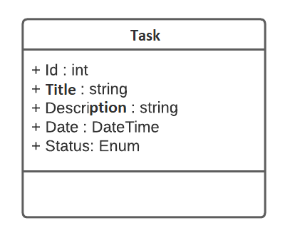
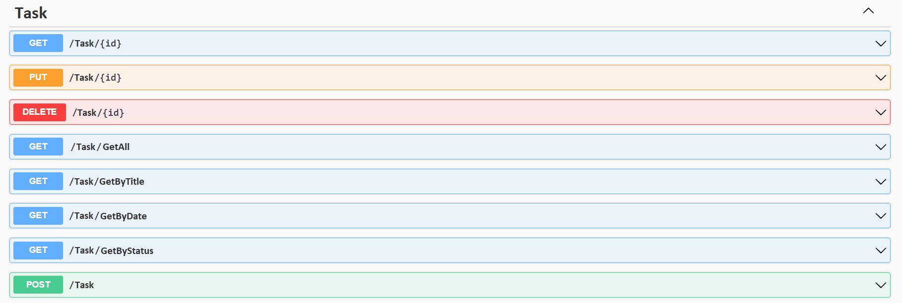

# Task Scheduling System

Project developed at Digital Innovation One's Pottencial .NET Developer Bootcamp with guidance from expert [Leonardo Buta](https://github.com/leonardo-buta/ "Leonardo Buta").

Learning to build a task manager system, to register a list of tasks that will allow you to better organize your routine.
This task list has a CRUD that allows getting the records, creating, saving and deleting these records.

## Diagram



## Swagger



## Endpoints

| Verb   | Endpoint              | Parameter | Body          |
|--------|-----------------------|-----------|---------------|
| GET    | /Task/{id}            | id        | N/A           |
| PUT    | /Task/{id}            | id        | Schema Task   |
| DELETE | /Task/{id}            | id        | N/A           |
| GET    | /Task/GetAll          | N/A       | N/A           |
| GET    | /Task/GetByTitle      | title     | N/A           |
| GET    | /Task/GetByDate       | date      | N/A           |
| GET    | /Task/GetGyStatus     | status    | N/A           |
| POST   | /Task                 | N/A       | Schema Task   |

This is the Task schema (model), used to pass to the methods that require it.

```json
{
  "id": 0,
  "titulo": "string",
  "descricao": "string",
  "data": "2022-10-24T17:00:01.059A",
  "status": "Pendente"
}
```

[LICENSE](./LICENSE)
